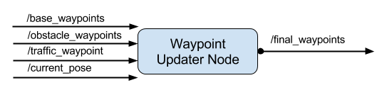

# Programming-a-Real-Self-Driving-Car

[//]: # (Image References)

[image1]: ./images_result/WaypointUpdaterNodeOverview.png "WaypointUpdaterNodeOverview"

### Waypoint Updater
The /base_waypoints topic publishes a list of all waypoints for the track, so this list includes waypoints both before and after the vehicle (note that the publisher for /base_waypoints publishes only once). For this step in the project, the list published to /final_waypoints should include just a fixed number of waypoints currently ahead of the vehicle.

  

This package contains the waypoint updater node: waypoint_updater.py. The purpose of this node is to update the target velocity property of each waypoint based on traffic light and obstacle detection data. This node will subscribe to the /base_waypoints, /current_pose, /obstacle_waypoint, and /traffic_waypoint topics, and publish a list of waypoints ahead of the car with target velocities to the /final_waypoints topic.

### Traffic light detection node [tl_detector.py]
This node takes in data from the /image_color, /current_pose, and /base_waypoints topics and publishes the locations to stop for red traffic lights to the /traffic_waypoint topic. 

  

![alt text][image1]
