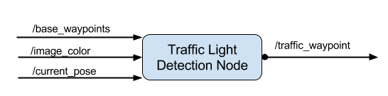

# Programming-a-Real-Self-Driving-Car

[//]: # (Image References)

[image1]: ./images_result/WaypointUpdaterNodeOverview.png "WaypointUpdaterNodeOverview"

### traffic light detection node [tl_detector.py]
This node takes in data from the /image_color, /current_pose, and /base_waypoints topics and publishes the locations to stop for red traffic lights to the /traffic_waypoint topic. 

  

![alt text][image1]
